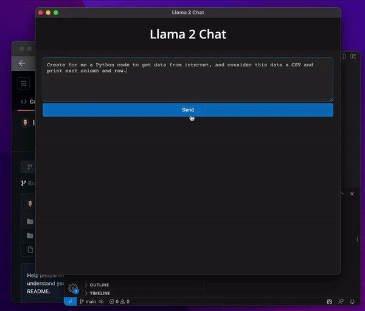

<p align="center">
    
</p>

---

# Llama2 Chat
A Chat GPT like using Meta AI Llama2.

It's free but for now it's working just on Mac with ARM processors.

## Requirements
- C/C++ (which you probably already have).
- NodeJS

## Usage
1. Clone this repository 
    ```bash 
    git clone https://github.com/moacirbrg/llama2-chat.git
    cd llama2-chat
    ```
2. Execute `setup.sh` to download everything and compile.
    ```bash
    cd llama_project
    bash setup.sh # It will download and compile everything
    ```
3. Install and run the chat:
    ```bash
    cd electron_app
    npm install
    npm start
    ```

---
Have fun!